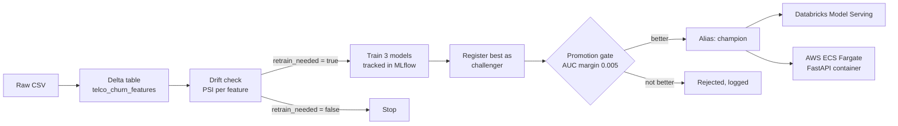
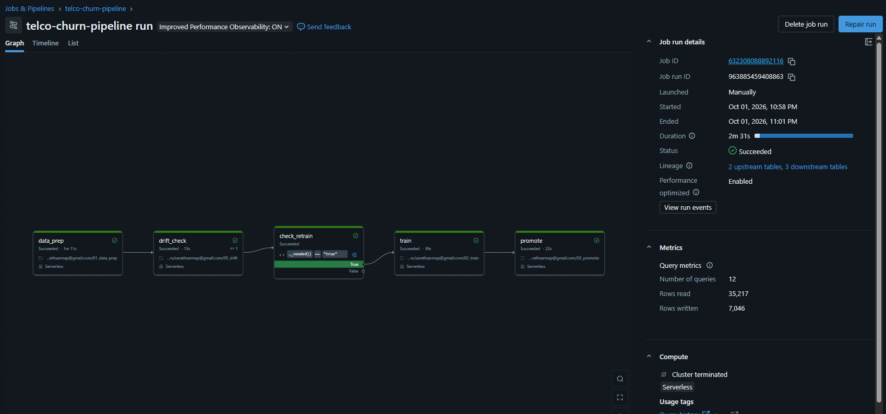
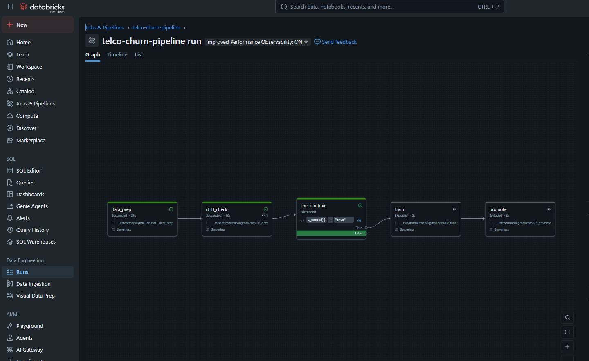
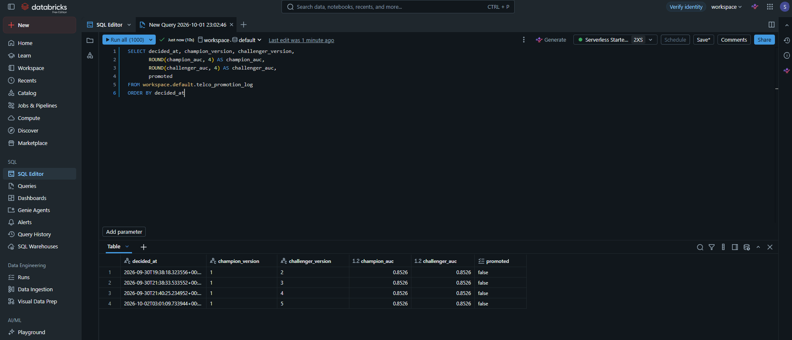
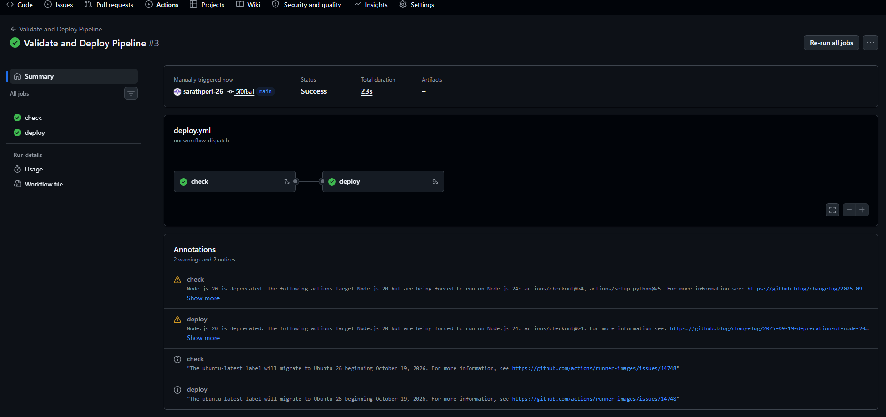
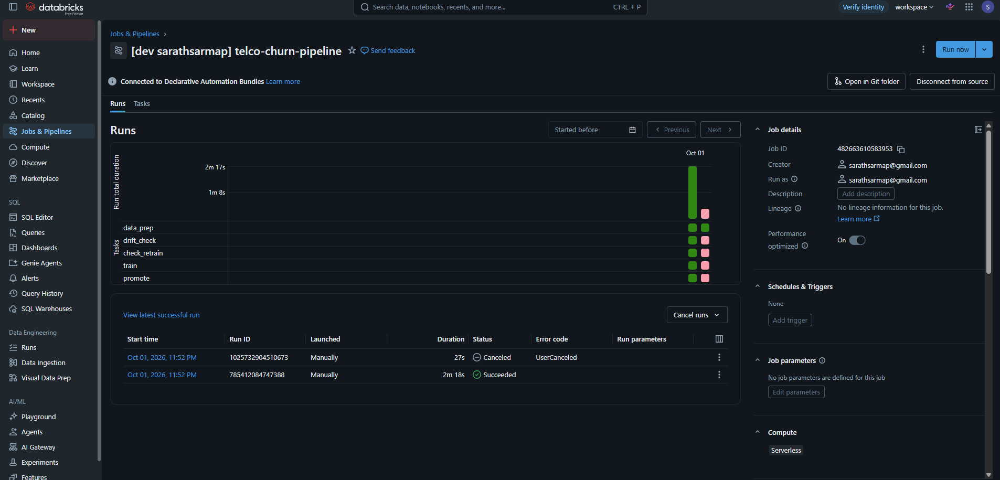

# Multi-Cloud MLOps Pipeline: Telco Churn on Databricks and AWS

An end-to-end MLOps pipeline that trains, registers, gates, serves, and monitors a customer churn model. Training, tracking, and the model registry live on **Databricks** (MLflow and Unity Catalog). The same approved model is served on **Databricks Model Serving** and on **AWS ECS Fargate**, and a Databricks Job retrains it automatically when drift is detected. The job is defined as code in a Databricks bundle and deployed by GitHub Actions.

## Architecture



## Results

**Data:** 7,043 customers from the public IBM Telco Customer Churn dataset, 26.5% churn rate. Train/test split is 5,643 / 1,400, assigned by a hash of `customerID`, so every retrain and every promotion decision is scored on the same customers.

**Models (test set):**

| Model | ROC-AUC | Precision | Recall | F1 |
|---|---|---|---|---|
| Gradient boosting (champion) | **0.853** | 0.711 | 0.554 | 0.622 |
| Random forest | 0.849 | 0.579 | 0.731 | 0.646 |
| Logistic regression | 0.848 | 0.525 | 0.795 | 0.632 |

The three models are within 0.005 ROC-AUC of each other, which is within noise on 1,400 rows. The more useful difference is the precision/recall trade-off at the default 0.5 threshold.

**Serving latency (20 sequential single-customer requests, warm):**

| Target | Median | p95 | Max |
|---|---|---|---|
| Databricks Model Serving | 154 ms | 189 ms | 206 ms |
| AWS ECS Fargate (FastAPI) | 11 ms | 49 ms | 51 ms |

These were measured differently and are not a head-to-head benchmark. The Databricks numbers go through the serving gateway (authentication and routing) from a notebook. The ECS numbers are direct calls from AWS CloudShell in the same region.

**Drift detection (Population Stability Index):**

| Feature | Stable batch | Drifted batch |
|---|---|---|
| MonthlyCharges | 0.011 | **1.642** (alert) |
| Contract | 0.000 | **0.140** (watch) |
| All other 17 features | ≤ 0.008 | ≤ 0.008 |

The drifted batch is simulated: test customers with a 25% price increase and 40% moved to month-to-month contracts. Only the two changed features moved, so the detector raised no false alarms.

## Pipeline runs

**Drift detected:** the condition takes the True branch, retrains, and sends the challenger through the gate. Full run in 2 minutes 31 seconds.



**No drift:** the condition takes the False branch, and training and promotion are skipped.



**Promotion gate audit log:** four automated challengers, all correctly rejected because they did not beat the champion by the required margin.



## CI/CD

Every push to `main` that touches the notebooks, serving code, or `databricks.yml` runs a GitHub Actions workflow: a syntax check, then `databricks bundle validate` and `databricks bundle deploy`. The first deploy completed in 23 seconds.



The deployed job is managed entirely from the repository (Declarative Automation Bundles), and its first run succeeded in 2 minutes 18 seconds.



## How it works

| Step | Notebook | What it does |
|---|---|---|
| Data prep | `01_data_prep.py` | Cleans the raw table (blank `TotalCharges` for new customers becomes 0, `Churn` becomes a 0/1 target) and writes a Delta feature table |
| Train | `02_train.py` | Trains logistic regression, random forest, and gradient boosting in a shared preprocessing pipeline, logs params, metrics, and models to MLflow, registers the best as `challenger` |
| Promote | `03_promote.py` | Scores champion and challenger on the same test set, promotes only if the challenger wins by at least 0.005 ROC-AUC, logs every decision to `telco_promotion_log` |
| Serving check | `04_serving.py` | Calls the Databricks serving endpoint and measures latency |
| Drift | `05_drift.py` | Computes PSI per feature, flags watch (0.1–0.2) and alert (> 0.2), logs to `telco_drift_log`, and passes `retrain_needed` to the next job task |

Models are always referenced by alias (`@champion`, `@challenger`), never by version number, so promoting a model needs no code changes downstream.

## Repository layout

```
notebooks/                  Databricks notebooks (source format)
serving/
  app/main.py               FastAPI service returning churn probability
  fetch_model.py            Pulls the current champion from Unity Catalog
  Dockerfile
  requirements-serve.txt    Pinned to the training environment
databricks.yml              The job defined as code (Databricks bundle)
.github/workflows/deploy.yml  Syntax check, then bundle validate and deploy
docs/images/                Pipeline run screenshots
```

## Running it

**Databricks (Free Edition works):**

1. Upload `Telco-Customer-Churn.csv` (from the IBM `telco-customer-churn-on-icp4d` repository) as the table `workspace.default.telco_churn_raw`.
2. Deploy the pipeline: `databricks bundle deploy`, or push to `main` with `DATABRICKS_HOST` and `DATABRICKS_TOKEN` set as GitHub secrets.
3. Run `01_data_prep`, then `02_train`, and set the first registered version as `champion`. After that, the job handles retraining and promotion.

**AWS ECS:**

```bash
cd serving
python fetch_model.py champion model
docker build --build-arg MODEL_VERSION=<version> -t churn-model:<version> .
```

Push the image to ECR and run it as an ECS Fargate service (0.5 vCPU, 1 GB) with port 8000 open. The model is baked into the image, so the container needs no credentials at runtime.

## Limitations

- Drift is simulated to test the detector. There is no live data feed.
- Retraining reuses the same data, so a challenger can never beat the champion here. In production, retraining would include newly labeled data.
- The 0.5 decision threshold is not tuned. The champion misses about 45% of churners at that threshold, and a retention use case would likely lower it.
- Single training run per model and no hyperparameter search.
- Built on Databricks Free Edition, which is serverless-only and quota-limited. Model Serving scales to zero, so the first request after idle is slow.
- The ECS image is built and deployed manually. Automating it from the registry is the natural next step.

## Stack

Databricks (Delta Lake, Unity Catalog, MLflow, Model Serving, Jobs, Declarative Automation Bundles) · scikit-learn · PySpark · pandas · FastAPI · Docker · AWS (ECR, ECS Fargate, CloudWatch) · GitHub Actions
